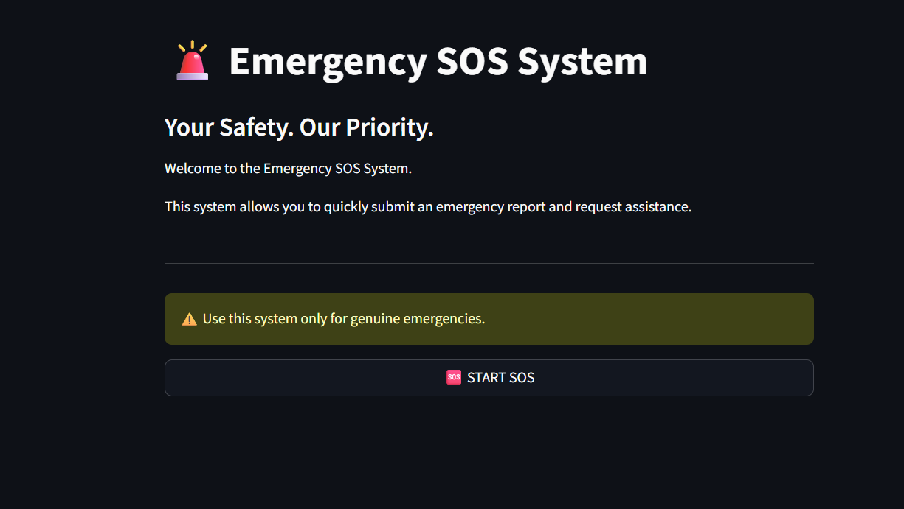
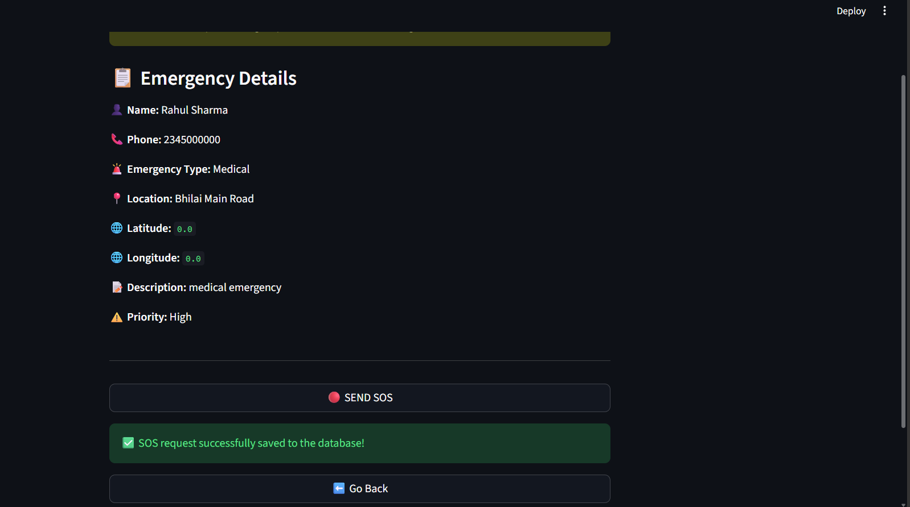
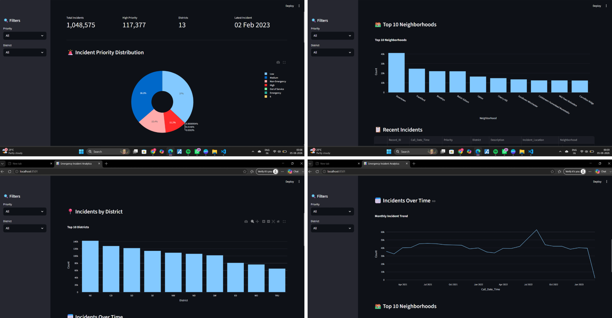

# 🚨 Emergency SOS & Incident Data Analytics System

## 📌 Project Overview

The Emergency SOS & Incident Data Analytics System is a data analytics project developed to collect emergency SOS reports and analyze incident data to identify useful patterns and insights.

The system combines a Streamlit-based emergency SOS interface, Python, and SQL Server for data collection, storage, and analysis.

## 🎯 Objectives

- Provide a simple interface for submitting emergency SOS reports.
- Collect and store emergency information in a SQL Server database.
- Analyze incident data to identify important patterns.
- Analyze incidents based on priority, district, and time.
- Present analytical results through visualizations and dashboards.

## ✨ Features

- Emergency SOS interface
- Emergency details collection
- Review and Send functionality
- SQL Server database integration
- Incident data analysis
- Priority-wise analysis
- District-wise analysis
- Time-based analysis
- Interactive analytics visualizations

## 🛠️ Technologies Used

- Python
- Streamlit
- SQL Server
- SQL
- Pandas
- Plotly
- Excel / Power Query

## 🔄 Project Workflow

Emergency-SOS-Incident-Data-Analytics-System/
│
├── screenshots/
│
├── analytics.py
├── app.py
├── database.py
├── emergency_sos.py
│
├── First.sql
├── Second.sql
├── third.sql
├── fourth.sql
│
└── emergency sos presentation.pdf

## 📊 Analysis Performed

The project analyzes emergency and incident data using:

- SQL queries
- Data aggregation
- Grouping and filtering
- Priority analysis
- District-wise analysis
- Time-based analysis
- Data visualization

## 🖥️ Screenshots

### Emergency SOS Interface



### Emergency Details


### Review and Send



### Analytics Dashboard



## 📁 Project Structure

```text
Emergency-SOS-Incident-Data-Analytics-System/
│
├── screenshots/
│
├── analytics.py
├── app.py
├── database.py
├── emergency_sos.py
│
├── First.sql
├── Second.sql
├── third.sql
├── fourth.sql
└── emergency sos presentation.pdf

## ⚙️ How to Run

1. Install Python.
2. Install the required libraries:

```bash
pip install -r requirements.txt

streamlit run app.py

## 📌 Note

This project uses a local SQL Server database. The database and connection settings need to be configured according to the user's local environment before running the application.

## 👩‍💻 Project

**Emergency SOS & Incident Data Analytics System**

Developed as a Data Analytics project using Python, Streamlit, and SQL Server.
